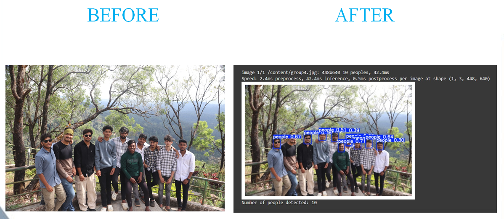

# 👥 Headcount Detection using YOLOv10

> A computer vision project that detects and counts people in images using a trained YOLOv10 object detection model.

## 🌟 Overview

The **Headcount Detection** project uses a YOLOv10 object detection model to identify people in images and calculate the total number of detected persons.

The project was developed and tested using **Python, YOLOv10, OpenCV, Roboflow, and Google Colab**.

The workflow includes dataset preparation, YOLOv10 model training, image inference, visualization of detected objects, and automatic headcount calculation.

---

## 🚀 Key Features

- Detects people in images using YOLOv10
- Trains a custom object detection model
- Uses bounding boxes to visualize detected people
- Processes uploaded images for inference
- Calculates the total number of detected people
- Displays detection results with confidence scores
- Uses GPU when available for model training

---

## 🛠️ Tech Stack

| Category | Technologies |
|----------|--------------|
| **Language** | Python |
| **Model** | YOLOv10 |
| **Computer Vision** | OpenCV |
| **Dataset** | Roboflow |
| **Development Environment** | Google Colab |
| **Libraries** | Ultralytics, PyTorch, Matplotlib |

---

## 🔄 How It Works

```text
            ┌──────────────────────┐
            │   Prepare Dataset    │
            └──────────┬───────────┘
                       │
                       ▼
            ┌──────────────────────┐
            │ Train YOLOv10 Model  │
            └──────────┬───────────┘
                       │
                       ▼
            ┌──────────────────────┐
            │ Upload Test Image    │
            └──────────┬───────────┘
                       │
                       ▼
            ┌──────────────────────┐
            │ Run Object Detection │
            └──────────┬───────────┘
                       │
                       ▼
            ┌──────────────────────┐
            │ Draw Bounding Boxes  │
            └──────────┬───────────┘
                       │
                       ▼
            ┌──────────────────────┐
            │ Count Detected People│
            └──────────────────────┘
```

## 🧠 Model Training

The project uses the **YOLOv10n** model from the Ultralytics framework.

Training was performed using:

- **Epochs:** 20
- **Image size:** 640 × 640
- **Batch size:** 4
- GPU acceleration when available

The trained model was then used for testing and image inference.


---

## 📊 Results

The model was tested on sample crowd images and generated bounding boxes around detected people.

### Example Result



The sample image shows:

**10 people detected**

## 📁 Project Structure

```text
headcount-detection-yolov10/
│
├── Headcount_Detection_YOLOv10.ipynb   # Google Colab notebook
├── result.png                          # Detection result
└── README.md                           # Project documentation
```
---

## 📚 What I Learned

Through this project, I gained practical experience in:

- Object detection using YOLOv10
- Image processing using OpenCV
- Training and testing a computer vision model
- Working with custom datasets
- Performing image inference
- Visualizing object detection results
- Using PyTorch and Ultralytics
- Working with Google Colab and GPU acceleration

---

## 🔮 Future Improvements

- Real-time people detection using video streams
- Improved accuracy for crowded scenes
- Web-based interface for image and video upload
- Cloud deployment
- Real-time headcount monitoring
- Integration with CCTV or video streams

---

## 👩‍💻 Author

**Mitali Rangani**

B.E. – Artificial Intelligence & Machine Learning

GitHub: [MITALI-CP](https://github.com/MITALI-CP)
